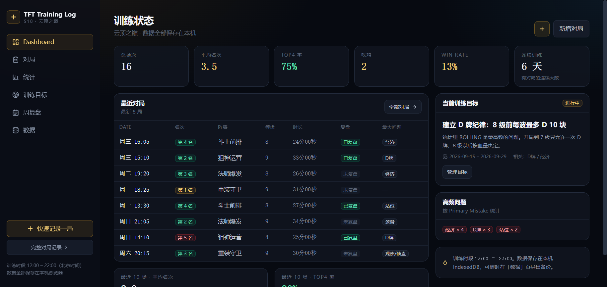
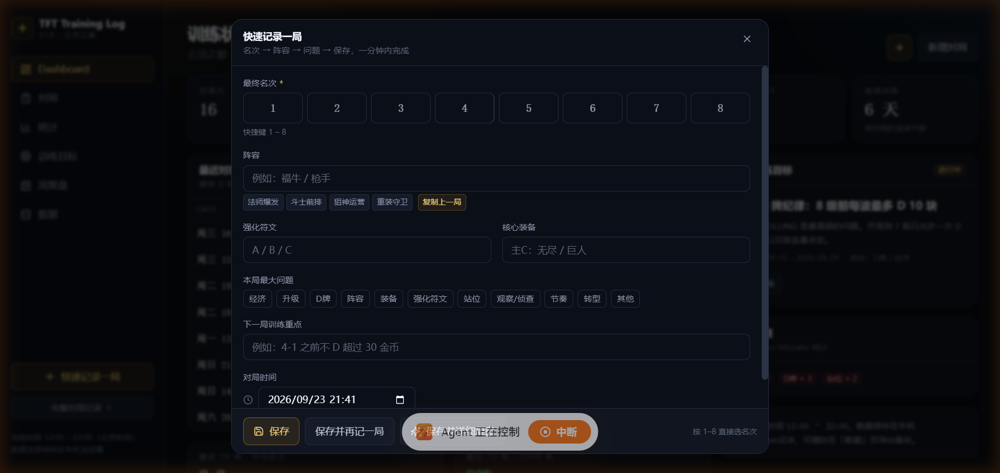
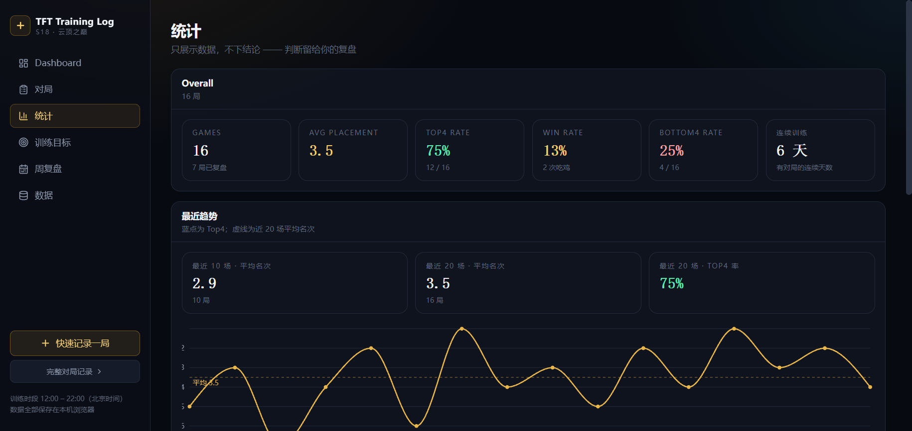
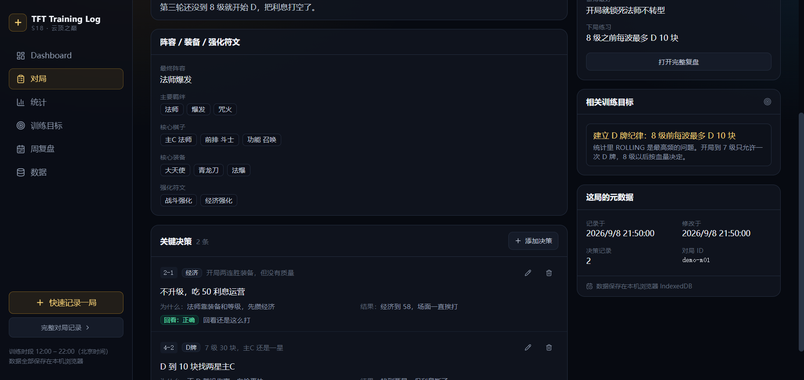

# TFT Training Log

**S18 Personal Training & Review System.**


**[Live Demo →](https://dwainyu.github.io/tft-training-log/)**

A local-first personal training system for recording TFT (Teamfight Tactics) matches,
tracking in-game decisions, reviewing mistakes, and measuring improvement over time.

No backend, no account, no telemetry — everything lives in your browser's IndexedDB.

> The UI is Chinese-first because it is built for the Chinese server, where
> `云顶之巅` ranked training runs daily from **12:00 to 22:00 (Beijing time)**.
> This is a personal training log. It is not a live assist, not a cheat, does not
> read the game process and performs no automation.

## Why

Most TFT tools answer *"what is strong right now"* — compositions, items, tier lists,
meta statistics. That data is public, and reading it does not make you better.

What a player actually lacks is a **training loop**: after a session you remember the
bad games, forget the good ones, and repeat the same three mistakes next week. This
project closes that loop with the smallest possible friction:

```
Match → Decision → Review → Statistics → Training Goal → Next Match ↺
```

Design constraints that follow from this:

- **Logging must cost 1–2 minutes.** Quick Add takes a whole game from keystroke `1–8`
  (placement) to saved, because a log you do not fill in is worth nothing.
- **Statistics must not invent conclusions.** Charts only show what you recorded; the
  interpretation is yours (a rule-based weekly summary is the only automated text, and
  it says so plainly).
- **Mistake type is a controlled vocabulary.** 11 types, chosen on the match and mirrored
  by the review, so `D 牌过深` shows up as a trend line instead of 30 loose sentences.

## Features

| Area | What it does |
| --- | --- |
| **Quick Add** | Core UX: press `1–8` for placement → composition → augments → biggest mistake → next-game focus → save. "Save & log another" keeps the dialog open for a whole session |
| **Match Logging** | Full create/edit form: timing, placement, final level / health / gold, duration, composition, traits, core units, core items, augments, free-text notes |
| **Match List & Detail** | Search, filters (placement range, review state, composition, mistake type, date), sorting, pagination; detail page links decisions, review, related goals and metadata |
| **Decision Log** | Per-match key decisions: round (`3-2`, `4-1`, finale), type (economy / leveling / rolling / transition / item / augment / positioning / stabilize / win-streak / lose-streak / …), situation, decision, reasoning, outcome, and *hindsight* (correct / wrong / mixed) |
| **Post-game Review** | Four-part structure — opening, mid game, late game, conclusion. Conclusion requires primary mistake, biggest mistake, best decision, next-game focus; only then is a match marked `reviewed` |
| **Statistics Dashboard** | Overall metrics, recent 10/20 trend line, mistake-type bar chart, per-composition table, per-time-slot table (12–14 / 14–16 / 16–18 / 18–20 / 20–22 / off-window) |
| **Training Goals** | Goal with date range, related mistake types, and `active` / `completed` / `archived` status; the current goal is surfaced on the dashboard and match detail |
| **Weekly Review** | Games, placements, Top-4 rate, bottom-4 rate, most common mistake, most played composition and the active goal for the week — generated by a swappable `ReviewSummaryProvider` |
| **Import / Export** | Lossless JSON snapshot (merge-import, upsert by id), CSV export for matches and decisions, storage overview, wipe |
| **Local-first Storage** | Dexie / IndexedDB. Works offline. The only way data leaves the machine is the export button you press |

## Screenshots

All four were taken against the bundled **fictional** demo dataset — see [Demo data](#demo-data).

| Dashboard | Quick Add |
| --- | --- |
|  |  |
| **Statistics** | **Match detail (decisions + review)** |
|  |  |

## Live Demo

**[dwainyu.github.io/tft-training-log](https://dwainyu.github.io/tft-training-log/)**

The demo runs entirely in your browser and keeps every record in local IndexedDB — pushing
`main` publishes the same static bundle through GitHub Actions. Load the
[demo data](#demo-data) to see all screens filled; nothing is uploaded anywhere.

## Getting Started

```bash
npm install
npm run dev          # http://localhost:5183/tft-training-log/
```

```bash
npm run build        # tsc --noEmit && vite build  -> dist/ (base: /tft-training-log/)
npm run test         # vitest run (16 files / 105 tests)
npm run typecheck    # tsc --noEmit
npm run preview      # serve the production build
```

### Demo data

A fresh install is empty. To see every screen with data in it:

- **In the app** — Dashboard empty state or the **Data → 示例数据** panel:
  *载入示例数据* (load demo), *清除示例数据* (remove demo, keeps your real records).
- **By file** — `data/examples/demo-matches.json` is a normal snapshot: load it through
  *Data → Import JSON*.

**Demo data is fictional and included only for demonstration.** It is not a real player's
match history. Ids are prefixed `demo-`, and the whole set is re-based onto the current
date when loaded, so streaks and the weekly view stay meaningful whenever you clone this repo.

## Tech Stack

- **TypeScript** (strict) + **React 19** + **Vite 6**
- **Tailwind CSS v4** (`@tailwindcss/vite`) — dark, data-dense UI
- **Dexie** (IndexedDB) + `dexie-react-hooks` `liveQuery` — local-first storage, reactive reads
- **react-router-dom** (`HashRouter`) — routes live in the hash, so the static bundle can be
  served from any sub-path (GitHub Pages project site) without server-side rewrites
- **Recharts** — trend lines and mistake bars
- **lucide-react** — icons
- **Vitest** + **Testing Library** + **fake-indexeddb** (jsdom) — 105 tests

## Architecture

```
pages/          route-level screens (Dashboard, Matches, Review, Statistics, Goals, Weekly, Data)
  ↓
components/     ui primitives + feature components (quick add, match form, decision panel, charts)
  ↓
services/       orchestration + invariants (what counts as "reviewed", cascade delete, merge import)
  ↓
domain/         pure functions: validation, mistake taxonomy, stats engine, query filters  ← unit tested
  ↓
data/           Dexie schema, per-table repositories, source adapters
  ↓
IndexedDB       matches / decisions / reviews / trainingGoals
```

Layering rules that keep it testable:

- `domain/` imports nothing from `data/`, `services/` or React — the statistics engine is pure
  and tested against hand-written fixtures (`[8,4,3,1] → avg 4.0, Top-4 75%, win rate 25%`).
- `services/` owns the invariants (e.g. `match.primaryMistake` is the single source of truth for
  mistake statistics, mirrored from the review on save; Quick Add seeds a partial review without
  marking the match reviewed).
- `data/repository/*` is the only layer that touches Dexie.
- Timestamps are **local wall-clock strings** (`YYYY-MM-DDTHH:mm`, no timezone): the target
  server is single-timezone, so sorting, date filters and the 12:00–22:00 window check are plain
  string comparisons. See `src/lib/wallclock.ts`.

```
UI → Services → Repository → IndexedDB
```

### Roadmap seams (already in the code)

- `data/adapters/types.ts` — `DataSourceAdapter` interface; only `ManualAdapter` is implemented.
- `services/review-summary.ts` — `ReviewSummaryProvider`; `RuleBasedSummary` is the only
  implementation, with `LLMSummary` / `AgentCoach` slots that no page needs to change for.
- `services/agent-tools.ts` — read-only, JSON-serializable facade
  (`get_recent_matches`, `get_match`, `get_recent_reviews`, `get_common_mistakes`,
  `get_composition_stats`, `get_training_goals`, `get_weekly_summary`) so a future coach agent
  or MCP server reads the same data the UI does.

## Data Source

**Phase 1 is manual entry only.** Nothing is scraped, read from the client, or fetched from an API.

- No automatic ingestion. You type what happened.
- The project deliberately does **not** depend on a Riot Match API for the Chinese server —
  one is not available to it, and correctness was never going to come from there.
- Future adapters may sit behind the existing `DataSourceAdapter` interface: an **LCU adapter**
  (own client, human-confirmed writes), a **screenshot adapter**, or a **Riot adapter** for regions
  where the official API is usable. None of them exists yet.

## Privacy

- All training data stays in your own browser (`IndexedDB`, database `tft-training-log`).
  The app makes no network request of its own.
- No account, no sync, no analytics, no crash reporting.
- Personal training records — real match history, notes, screenshots, exports, databases —
  are **git-ignored** and never committed. `.gitignore` excludes local `data/` (except
  `data/examples/`), root-level `screenshots/`, `.env*`, `*.db`, `*.sqlite*`, `coverage/`, `dist/`.
- The only data in this repository is source code, tests, docs, the schema and the fictional
  demo dataset.
- Back yourself up: *Data → Export JSON* before clearing browser storage or switching machine.

## Roadmap

**Phase 1 — Manual Training Log (MVP)** — done

- [x] Match logging (create / edit / delete with cascade)
- [x] Quick Add
- [x] Decision log
- [x] Post-game review
- [x] Statistics dashboard
- [x] Training goals
- [x] Weekly review
- [x] JSON export / import, CSV export
- [x] Agent tool facade (read-only)

**Phase 2 — S18 static data**

- [ ] Units, traits, items, augments as structured data — replace free text with pickers and autocomplete

**Phase 3 — China client (LCU) adapter**

- [ ] Read the local client's own game-end data, with human confirmation before anything is written

**Phase 4 — Automatic match ingestion**

- [ ] Detect and log games inside the training window, so recording stops being the reason you skip it

**Phase 5 — Screenshot / replay analysis**

- [ ] Key-round screenshots and annotation

**Phase 6 — Agent Coach**

- [ ] `LLMSummary` weekly review, personalised advice grounded in your own decision log

**Phase 7 — MCP**

- [ ] Expose `agent-tools` as an MCP server

Full phase list with scope notes: [ROADMAP.md](./ROADMAP.md).

## Current Limitations

- Compositions, items and augments are free text (Phase 2 will structure them).
- Times are hand-entered Beijing wall-clock; there is no timezone or DST handling, by design.
- The weekly summary is a rule engine, not an LLM.
- Data is per-browser. Export JSON is the only migration path.
- The public deployment is a static GitHub Pages bundle — still no backend, no sync, no telemetry.

## Contributing

This project is primarily built for personal TFT training. Issues and questions are welcome;
please open one before proposing a feature, since the roadmap above is intentionally narrow.

## License

[MIT](./LICENSE)
